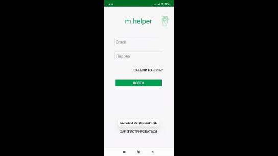
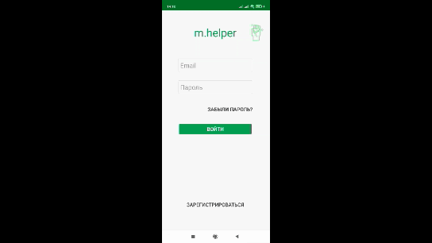

# mHelper
# Введение
Целью моего исследования является разработка мобильного приложения «mhelper» для организаций повседневной работы волонтеров. Исследование состоит в изучении современных технологий и средств разработки мобильных приложений, в выборе оптимального средства реализации проекта, самой реализации и документировании проделанной работы в пояснительной записке. Данное исследование посвящено разработке мобильного приложения для платформы Android используя язык программирования от составления технического задания до реализации конечного продукта. Совершена оценка примененных и исследованных подходов. Определены основные преимущества и недостатки созданного решения. Бесплатное мобильное приложение «mhelper» создано для волонтёров и неравнодушных людей. Устанавливается в качестве мобильного приложение на телефонах поддерживающих операционную систему. С помощью данного приложения у волонтеров/добровольцев есть возможность помочь нуждающимся и их близким. В приложении прописывается основная информация о помощи для пользователей приложения (добровольцев/волонтеров). Это может быть информация, как о помощи одинокой бабушке наколоть дрова, так и участие в крупных добровольческих мероприятиях региона. 
Гипотезой исследования я предполагаю будет процесс точечной помощи волонтерами нуждающимся в данный момент социально незащищенным слоям населения, физически ограниченным людям и т.п. Деятельность волонтеров направлена в первую очередь на помощь остронуждающимся слоям населения, не имеющим возможности помогать себе самим (старость, беспризорность, инвалидность, стихийные бедствия, социальные катаклизмы, катастрофы). Наблюдая за работой волонтерских фондов, я заметил, что одновременно большое количество волонтеров помогают большому количеству нуждающихся в помощи людям в определённые дни. Например, участникам и ветеранам ВОВ только на день Победы. Однако, в повседневной жизни достаточно большое количество нуждающихся людей испытывают необходимость в реальной обыденной социально- бытовой помощи. Таким образом, нуждающиеся люди ощущают сложность, ограничение либо невозможность получения точеной помощи в любой момент времени и места. С целью решения данной проблемы мною разработано специальное мобильное приложение «mhelper» для волонтеров и нуждающихся – приложение, содержащее обширную базу людей, которым время от времени нужна помощь волонтеров и непосредственно база самих волонтеров. Зарегистрированные в приложении нуждающиеся в случае необходимости делают запрос для оказания необходимой помощи, а волонтер выбирает в приложении того, кому он может помочь. Так можно оказывать помощь каждый день точечно. Новизной проекта я считаю увеличение скорости взаимодействия между волонтерами и нуждающимися. Я нахожу свой проект со средней степенью самостоятельности так как оно пока не зависит от других приложений, но при этом база данных хранится на серверах сервиса Firebase. Отсюда следует что, при преодолении определенного объёма хранимых данных, данный сервис становится платным. Так как мой проект является социальным и бесплатным для волонтеров и нуждающихся, соответственно он не имеет функции получать оплату за пользование им.  Поэтому возникает необходимость в спонсорской помощи (государственной или коммерческой) для хранения данных проекта на сервисе Firebase.Результатом моей работы в данном исследовании является мое мобильное приложение «mhelper», призванное помогать людям находить у друг друга помощь. Подытоживая, я предполагаю, что оно будет эффективным в данном вопросе потому что оно возникло по выше обозначенной необходимости. Областью применения моего приложения считаю может быть от обычной бытовой помощи до медицинско-волонтерской и др. 
 

Individual Identification Number validating app 

Several projects I'm working on require IIN from users or clients. There is a simple app for IIN validation without third-party services.  
 

Individual Identification Number validating app 

Several projects I'm working on require IIN from users or clients. There is a simple app for IIN validation without third-party services.  
 

